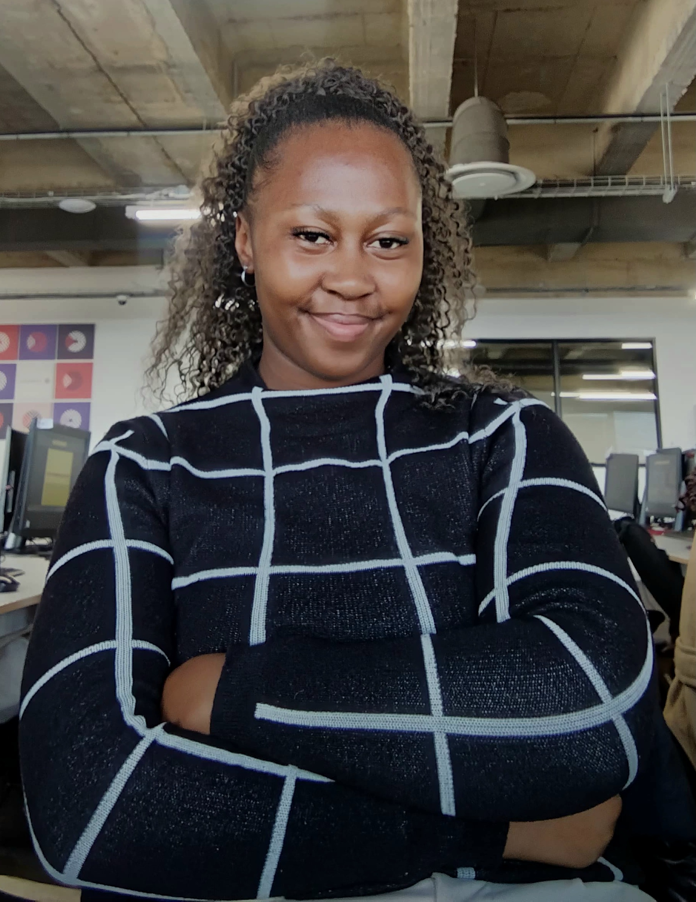

# Hi, I'm Joyce Sellwane Mosia 👋

### Welcome to my GitHub! Take a look around and feel free to explore my work 🚀

### Software Developer | South Africa

I'm a full-stack developer passionate about building AI-powered tools and cybersecurity-focused software. I care about clean, maintainable code, thoughtful user experience, and responsible AI development.

---

### 🚀 About Me

Currently an **End-to-End Technology Intern at Capaciti (UVU Africa)**, contributing to full-stack applications across the entire SDLC — from design and development through to testing and deployment — while strengthening my skills in software development, application security, and industry best practices through mentorship and hands-on projects.

### 🛠️ Tech Stack

**Languages:**    

**Web:**    

**Data & Tools:**   

### 📌 Projects

| Project | Description |
|---|---|
| [NexGen Studio](https://github.com/sellwane7/nex-gen-studio) | AI content generator |
| [BizIntel AI](https://github.com/sellwane7/Bizintelai) | AI-powered business dashboard |
| [CyberSage](https://github.com/sellwane7/CyberSage) | Municipal integrity platform |
| [Minetrax](https://github.com/sellwane7/mintrax-ai) | Mining safety intelligence platform |
| [DeskFlow](https://github.com/sellwane7/deskflow) | Internal IT service request portal |

### 📂 Explore All My Repositories

Browse the full list — each one is clickable straight from the repositories page, with live descriptions and languages.

